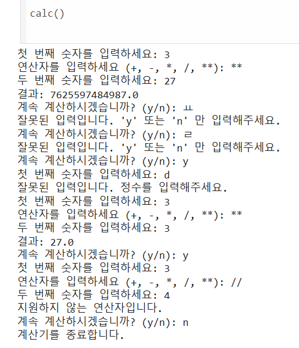
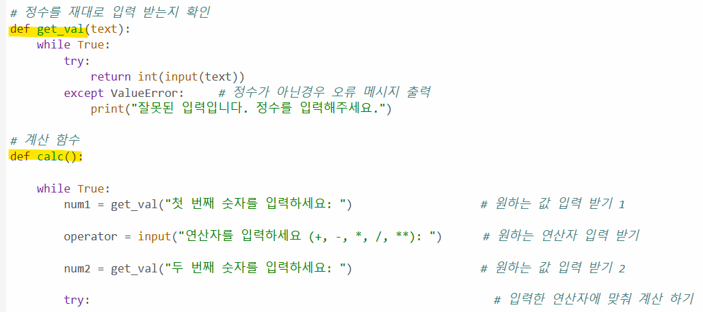
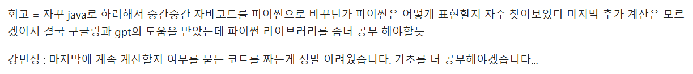

# AIFFEL Campus Online Code Peer Review Templete
- 코더 : 최창윤
- 리뷰어 : 채남병


# PRT(Peer Review Template)
- [Y]  **1. 주어진 문제를 해결하는 완성된 코드가 제출되었나요?**
    - Calc 함수를 사용하여 과제를 해결하고 코딩물과 테스트 결과가 함께 제시되었습니다.
    -      
    
- [Y]  **2. 전체 코드에서 가장 핵심적이거나 가장 복잡하고 이해하기 어려운 부분에 작성된 
주석 또는 doc string을 보고 해당 코드가 잘 이해되었나요?**
    - 정수 입력함수를 만들었지만, 실제 입력은 계산 함수에서 발생하는 이유가 이해하기 어려웠습니다.
    -  
    - 나눗셈과 관련한 에러를 처리하는 부분은 향후 코칭에 참조해보도록 하겠다. 
    - 
        
- [Y/]  **3. 에러가 난 부분을 디버깅하여 문제를 해결한 기록을 남겼거나
새로운 시도 또는 추가 실험을 수행해봤나요?**
    - 작성한 코드의 작성에 대한 테스트가 여부를 확인할 수 있었습니다.
    - 이는 상단의 결과물 이미지 참조 바람니다.
         
- [Y]  **4. 회고를 잘 작성했나요?**
    - 개발과 관련한 애로 사항을 잘 작성하였습니다.
    - 
        
- [Y/N]  **5. 코드가 간결하고 효율적인가요?**
    - 숫자와 연산자를 입력하는 부분에서 입력자가 편한 방식으로 프로그램을 짜는 것에 대해 피드백 드립니다.
    - 


# 회고(참고 링크 및 코드 개선)
```
# 저희 팀이 작성하면서 힘들었던 부분을 타팀의 내용을 보면서 도움을 받을 수 있어서 잘 짜여진 그리고 완결된 프로그램을 볼 수 있어서 좋았습니다. 
# 지속적으로 시간 부족을 겪는 저에 비해 완결도가 높은 코드를 작성해 해는 부분은 배울점입니다. 수고하셨습니다. 
```
